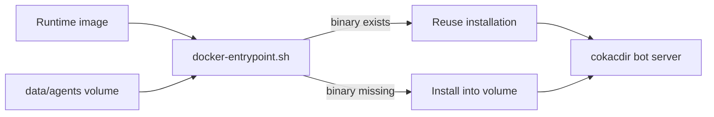
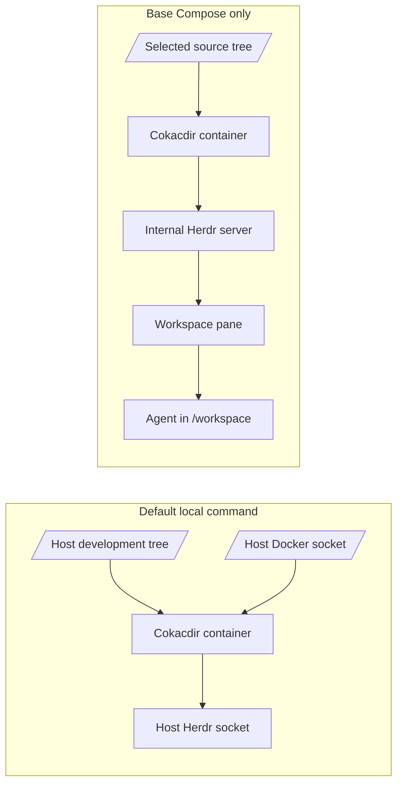

# Project Memory

## Telegram bot tokens

The existing Telegram bot remains configured through `COKACDIR_BOT_TOKEN`.
Additional bot tokens can be stored one per line in
`data/cokacdir/bot-tokens`, mounted at
`/home/cokac/.cokacdir/bot-tokens`. `docker-entrypoint.sh` combines both
sources, removes blank and duplicate lines, and starts cokacdir with
`--ccserver-token-file` so tokens do not appear in process arguments. Never
commit or print the token file. When both sources are empty, the Compose TTY
keeps cokacdir running in its normal terminal UI mode without starting the bot
server.

## Agent CLI installation

Codex, Claude, and Agy are not embedded in `cokacdir-agents:latest`. The runtime
image contains Node.js/npm, Python 3 with `venv`, curl, the Docker CLI, the
patched `cokacdir` binary, and the Herdr CLI. It also includes the shared
`python3-yaml` runtime package for agent skills that read YAML. Other Python
dependencies should be installed in project-local virtual environments rather
than into the system interpreter.

`docker-compose.yml` mounts `./data/agents` at `/home/cokac/.agents`. On startup,
`docker-entrypoint.sh` installs a provider only when its executable is missing:

- Codex: `/home/cokac/.agents/npm/bin/codex`
- Claude: `/home/cokac/.agents/npm/bin/claude`
- Playwright client: `/home/cokac/.agents/npm/bin/playwright-core`
- Agy: `/home/cokac/.agents/bin/agy`

The installers run as UID/GID 1000. Subsequent container recreations reuse the
mounted files. Removing `data/agents` forces a fresh installation and therefore
requires network access. Codex and Claude use npm; Agy uses its official installer
with `--dir`.

The `cokacdir` service exposes `BROWSER_CDP_URL=http://browser:9222` and sets
`NODE_PATH` to the persistent npm modules directory. Agent scripts can therefore
use `require("playwright-core")` without setting `NODE_PATH` manually and connect
to the shared browser with `chromium.connectOverCDP(process.env.BROWSER_CDP_URL)`.



Verify the lifecycle with:

```bash
docker compose build cokacdir
docker compose up -d --force-recreate cokacdir
docker compose logs --tail=100 cokacdir
docker exec cokacdir codex --version
docker exec cokacdir claude --version
docker exec cokacdir agy --version
docker exec cokacdir herdr --version
```

## Herdr provider

`Dockerfile` checks out Cokacdir commit
`5ad75524c1ec566b4c4394d0ff545a5466f2f1da`, copies
`patches/herdr.rs`, applies `patches/herdr-provider.patch`, and builds the
binary. It also installs Herdr 0.8.0 from its pinned release asset after
verifying SHA-256. Keep the source commit, patch, Herdr version, and checksum
aligned when upgrading either project.

Herdr 0.8.0 uses socket protocol 19. In external mode, update the image-side
Herdr client together with the host server: a 0.7.5 client (protocol 17) can
report server status but agent commands fail with `protocol_mismatch` against a
0.8.0 host. Verify `compatible: yes` with `herdr status server` and run an
actual command such as `herdr agent list`; an HTTP- or socket-level readiness
check alone is not sufficient.

The provider routes `/model herdr:<agent-name>` to an already-running Herdr
agent. Bare `/model herdr` uses `COKAC_HERDR_AGENT`, which Compose defaults to
`worker`. A turn runs `herdr agent prompt ... --wait`, reads the agent's recent
terminal output, and extracts the final Codex TUI response block between
the current prompt boundary and the next input prompt for Telegram. It does not
add response-marker instructions to the agent prompt, and strips legacy marker
lines left in an existing session. The prompt boundary parser recognizes Codex's
`› ` marker, AGY's `> ` marker, and Grok's `❯ ` marker (U+276F). AGY and Grok
output ends at the next TUI separator so earlier turns are not returned. Codex
`─ Worked for ...` and Grok `Worked for ...` status lines are separators and
must not be delivered to Telegram. Grok wraps long prompts, stamps a clock on
the right, and draws chrome (`◆` hooks, thought lines, the `Help improve`
banner, a right-edge `█` scrollbar, and the `│ ❯` input box); those are
stripped before the answer is published. Table rows that start with `│` are
content, not the input box. Wrapped prompt echoes are matched without
whitespace so a mid-word split such as `이`/`름` is not left in the answer.
Grok repeats the current user prompt as a sticky viewport header; the
extractor prefers the copy followed by `◆` hooks and keeps reading through
later header replays until `Worked for`. Quote-box `│` padding and Herdr
`┆` unwrap duplicates are stripped. Codex turns are bounded at the next `›`
composer line so Grok-only separators do not apply, and `•` answer lines are
kept while tool headers such as `• Ran` are dropped. Other terminal layouts fall back to the terminal delta. `/stop`
also sends `ctrl+c` to the target agent. Cokacdir does not create or resume the
Herdr agent; start it in a suitable Herdr pane first.

Set `COKAC_HERDR_COMPLETION_NOTIFY_CHAT_ID` to an explicit Telegram chat ID to
watch the Herdr agent selected by that chat's `/model herdr:<agent-name>` setting.
The watcher is disabled when the variable is empty. It polls `herdr agent get`,
requires a five-second stable `idle` or `done` state after `working`, and sends a
new completion message when the task ran for at least
`COKAC_HERDR_COMPLETION_NOTIFY_MIN_S` (default 300 seconds). This includes
requests initiated through Cokacdir because their streamed response is delivered
by editing an existing Telegram message, which does not trigger a new-message
notification. Those owned requests receive only the short completion notice;
externally started Herdr work also includes a bounded recent-result preview. Do
not enable this watcher together with another Herdr completion watcher for the
same agent and chat, or duplicate notifications can result. The standalone
`herdr-telegram-remote` service was removed from `docker-compose.yml` after this
watcher was enabled; its source directory remains only as a local reference and
is not required to run the Compose stack.

The Herdr provider forwards only the current request payload. It must not prepend
Cokacdir's generated system prompt: a Herdr-managed Codex session already has its
own system and project instructions, and forwarding Cokacdir's full prompt would
repeat operational guidance in every terminal turn.

Compose mounts the host Herdr config directory, including its Unix sockets, at
`/home/cokac/.config/herdr`. The source defaults to
`/home/linuxse/.config/herdr`; set `HERDR_CONFIG_DIR` on another host. Mount the
directory rather than an individual socket because Herdr replaces socket files
when it restarts. `HERDR_SOCKET_PATH` explicitly selects the mounted server
socket. Do not set `HERDR_ENV=1` on the Cokacdir container: it is a socket
client, not a Herdr-managed pane. Treat this mount as privileged terminal
control and do not expose it to unrelated containers.

Verify the bridge without changing an agent:

```bash
docker exec cokacdir herdr agent get worker
docker exec cokacdir herdr agent read worker --source recent-unwrapped --lines 20
```

### External and internal Herdr modes

The Compose files support two Herdr execution modes without changing the
existing host workflow:

- `docker compose ...` automatically merges `docker-compose.override.yml`.
  The override selects `HERDR_MODE=external` and restores the host Herdr
  directory, `/home/linuxse/dev`, the Vera checkout, and the host Docker socket.
- `docker compose -f docker-compose.yml ...` uses the portable base file only.
  It selects `HERDR_MODE=internal`, mounts a dedicated `herdr-config` volume,
  does not mount the host Docker socket, and mounts
  `COKACDIR_WORKSPACE_DIR` (default `./workspace`) at `/workspace`.



Internal mode starts the headless Herdr server, waits for socket readiness,
reuses a restored empty pane when available, creates a workspace otherwise,
and starts `COKAC_HERDR_AGENT` with `COKAC_HERDR_AGENT_KIND`. Herdr, the agent,
and Cokacdir run as `CLAUDE_RUN_UID:CLAUDE_RUN_GID` (default `1000:1000`); the
entrypoint shell stays root only for initialization and lifecycle management.
The server and Cokacdir are supervised together so either process exiting stops
the other.

Run the isolated mode on a host where the selected source path belongs to UID
1000:

```bash
COKACDIR_WORKSPACE_DIR=/path/to/source \
  docker compose -f docker-compose.yml up -d cokacdir
docker compose -f docker-compose.yml logs --tail=100 cokacdir
```

Verify the two effective configurations without printing secrets:

```bash
docker compose config --quiet
docker compose -f docker-compose.yml config --quiet
```

## Browser live view

`browser-base` builds the pinned Kernel Images commit with `scale: 0`, so it is
available to the build graph but never runs as a container. `browser/Dockerfile`
uses that service as an additional build context and produces
`playwright-novnc:452f342`. All files under `browser/` that are needed at runtime
are copied into this custom image; do not reintroduce host bind mounts for these
files. The custom layer shares the large upstream layers and installs Fluxbox,
x11vnc, noVNC, and websockify for the low-CPU live view.

Build the browser image with:

```bash
docker compose build browser
```

The `browser` service disables the upstream Neko WebRTC process and serves the
existing Xorg display through `x11vnc` and noVNC. The host live view defaults to
`http://127.0.0.1:7903/vnc.html`; this host uses
`http://192.168.75.142:7903/vnc.html`. Port `5900` is bound to the container
loopback only, while websockify listens on container port `6080`. CDP `9222` and
the Kernel Images API `10001` remain Compose-internal; agents connect with
`http://browser:9222`.

Use `NOVNC_BIND_ADDRESS`, `NOVNC_PORT`, and `NOVNC_PASSWORD` for the public
Compose settings. Avoid the generic `BIND_ADDRESS` name because it is unclear
which service it controls.

Set `NOVNC_PASSWORD` before binding the live view to a LAN address. The wrapper
stores it in `/tmp/x11vnc.pass` with mode `0600` and never exposes the VNC port
on the host. noVNC is plain HTTP/WebSocket, so keep it on a trusted LAN or VPN,
or place it behind an authenticated HTTPS reverse proxy. The previous Neko port
`7902` is intentionally closed: already-open browsers can retain the old Neko
frontend and repeatedly reconnect to `/ws` if the same port is reused.

The upstream wrapper expects a Supervisor program named `mutter`, but the
custom image replaces its command with Fluxbox. Mutter composition combined
with x11vnc screen reads caused continuous SwiftShader and Xorg redraws even on
a static screen. Fluxbox preserves window management and Chromium maximization
without that compositor loop. Keep the Supervisor program name unchanged so
the pinned upstream wrapper continues to start it.

Set `BROWSER_ENABLE_WEBGL=1` to replace the GPU-disabling flags with
`--enable-webgl`, `--use-angle=swiftshader`, and `--ignore-gpu-blocklist`.
SwiftShader uses CPU resources, so leave the variable unset or set it to `0`
when WebGL is unnecessary. The browser defaults to eight cores for WebGL-heavy
automation, although a static noVNC connection no longer runs a fixed-rate VP8
encoder. Set `BROWSER_CPUS` only when the host requires a different limit.
The browser entrypoint writes `/chromium/flags` directly before starting the
upstream wrapper; no separate initialization service or flags volume is used.

The browser healthcheck runs the image-bundled `browser/readiness.js` with the
upstream image's `/usr/local/lib/node_modules/playwright-core`. A healthy result
requires running x11vnc and noVNC Supervisor programs, an HTTP response from
`/vnc.html`, a real CDP connection, at least one context and page, and a
successful DOM query. Connecting through the HTTP CDP endpoint instead of caching its
WebSocket URL ensures Chromium restarts use the new debugger address. The check
runs every 60 seconds to limit normal CDP disconnect log noise while retaining
useful failure detection. If the proxy HTTP endpoint still responds but the
real CDP probe fails, readiness restarts only Supervisor's `kernel-images-api`
process and retries once. This preserves Chromium, open tabs, and the login
profile while recovering a stalled port 9222 WebSocket proxy. Kernel Images
currently logs normal CDP client
disconnects as `client read error` and `upstream read error`; these messages do
not by themselves indicate a readiness failure.

`browser/container-wrapper.sh` stops Chromium before signaling the upstream
Kernel Images wrapper, preventing DBus and Xorg from disappearing first during
a full container shutdown. `browser/chromium-wrapper.sh` then handles Supervisor
TERM by sending the CDP `Browser.close` command and waiting for Chromium to save
the profile. It marks the profile clean only after that path succeeds.
Supervisor waits 10 seconds and uses KILL only on timeout; Docker allows 20
seconds before forcing the container down.
